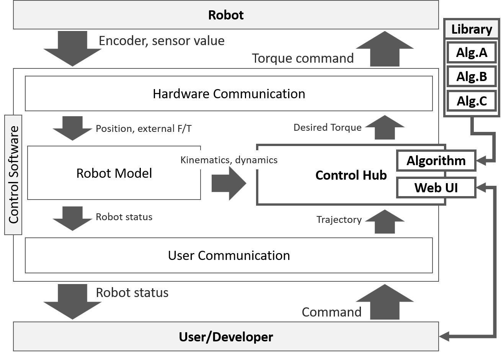

# Indy7-rnb_control-bulletSim

# Instruction for RNB-Control Framework {#mainpage}

**RNB-Control** is a control framework to enable agile development of control algorithms for robot systems.  
* **ControlHub** enables runtime replacement of the control algorithm and easy gain tuning with Web UI.
* A motion trajectory can be passed to the controller easily by **TrajectoryInterface**. You can pass a low-frequency trajectory because the **TrajectoryInterface** interpolates it to high frequency. On-line trajectory tracking is also available. The python example client provides a function that transforms a sequence of waypoints to a trajectory with fixed timesteps.



## IMPORTANT DEVELOPER NOTE - Follow below rules
* **Branching strategy: gitflow**
* **Coding style: PEP8**
* **Comment style: doxygen**

## Environment(Requirements)  
* OS: Linux, Windows

## How to Apply to your Hardware
  
### Add control_hub folder in your project
* **Linux - cmake**
  - make a symbolic link to *controlhub* folder to your hardware control project.
  ```bash
  cd YOUR_CONTROL_PROJECT_SRC
  ln -s RELATIVE_PATH_TO_CONTROL_HUB ./control_hub
  ```
  - example (PandaControlRNB)
  ```bash
  cd ~/Projects/rnb-control/projects/PandaControlRNB/src/panda_control
  ln -s "../../../../control_hub" ./control_hub
  ```
* **Windows - Eclipse** (Assume *rnb-control/projects* is the workspace folder)
  - Right click the project and go to: New -> Folder -> Advanced -> Link to alternate location
  - Enter ```PROJECT_LOC\..\..\control_hub``` and Finish.
  - Right click the project and go to: Properties -> C/C++ General -> Paths and Symbols -> includes
  - For both *GNU C* and *GNU C++* tab, add ```${ProjDirPath}\..\..\control_hub```.
  - Repeat above for all build configurations you use
* **Windows - VisualStudio**
  - Right click the project and *Add -> New Filter -> control_hub*
  - Drag and drop all contents of control_hub into the created filter
  
### ControlHub
1. Create a **ControlHub** instance. The control mode(Joint/Task), joint degree of freedom, task degree of freedom, and control step time should be specified.
2. Call **ControlHub::reset_controller(Q)** when ever the hardware calls reset.
3. Inside the control loop, call **ControlHub::check_nominal_reset()** first. This will return *true* while and just after the controller is reset. Reset your nominal model too when this function returns true.
4. Call **ControlHub::calculate_joint_control_torque()** or **ControlHub::calculate_task_control_torque()** in the control loop, depending on the control mode. Check the function comments or doxygen document for the parameter information.
  * To prevent needless computations, **ControlHub** has **4** flags for information usage. Each controller will have this values to specify if it uses certain information. For example, *use_nominal_dynamics* and *use_nominal_kinematics*: are *False* for **PD** controller, as it does not use nominal model. Thus, compute for these values selectively based on these flags.
    - *use_real_dynamics*: The controller use real robot's dynamic parameters (*M*, *C*)
    - *use_nominal_dynamics*: The controller use nominal dynamic parameters (*M_n*, *C_n*)
    - *use_real_kinematics*: The controller use nominal dynamic parameters (*J*, *Jdot*)
    - *use_nominal_kinematics*: The controller use nominal dynamic parameters (*J_n*, *Jdot_n*)

### TrajectoryInterface
The TCP/IP based trajectory interface is included in the ControlHub, but if you need trajectory interface only, you can use the trajectory client separately. TrajectoryInterface includes Cspline interpolation and online tracking features. 
1. Create a **TrajectoryInterface** instance. The control mode(Joint/Task), trajectory degree of freedom, and control step time should be specified.
2. Call **TrajectoryInterface::update_position(Q)** to give information about current robot pose.
3. Call **TrajectoryInterface::reset_traj()** when the hardware calls reset. Make sure at least one **update_position** is called before any **reset** call, sothat the **TrajectoryInterface** can be reset with recent robot pose information.
4. Call **TrajectoryInterface::get_next_qc()** in the control loop to get current target pose, velocity, acceleration.
  * TrajectoryInterface::follow_traj is a flag that is set with the client's "follow" command and cleared with "stop" command. The trajectory is not tracked when this flag is not set.

## To use with IndySDK
* Follow instruction in [projects/IndyControlRNB/README.md](.projects/IndyControlRnb/README.md)

## To use with Franka emika Panda
* Follow instruction in [projects/PandaControlRNB/README.md](.projects/PandaControlRnb/README.md)

## To use with BulletSimulator
* Follow instruction in [projects/BulletSimControl/README.md](.projects/BulletSimControl/README.md)

## How to use WebUI
* Control WebUI is on http://{ROBOT-IP}:9990/ after launching robot or you can access WebUI through python (see scripts/WebClient Example)
* Selecting controller
  * **Select** : it changes current controller to chosen controller
  * **Set Default** : it allows current controller to be a default controller
* Gain tuning
  * **Apply** : it applies current state of gains 
  * **Save / Load** : it saves current gains and loads saved gains
* Data plot/save
  * **Apply** : it regulates time step of plots
  * **Restart Log / Pause Log** : it starts and stops showing plots
  * **Download Full** : it save data from the moment you press this button to 30 secs ago. Before download saved data, pause log at the first
  * Assign values to **custom_dat (JOINT_DOF)** inside you controller, to plot your specific internal variables.
* When logging data, conflicts may occur because of high control frequency
  * solution : recommend to decrease below 2000Hz and control frequency can be regulated in "indyDeploy.json" (same path of TaskManager)
* When start logging, high calculation time of controller(NRIC_force) makes error and robot stops
  * solution : after changing another controller(PD, NRIC_PD, ...), restarting log and waiting a few seconds, then change to desired controller
* **[NOTE]** To plot data, ***assets*** folder should be copied to the program working directory.

## Trajectory Interface (python)
* Open [trajectory_clilent_python/trajectory_client_example.ipynb](.trajectory_clilent_python/trajectory_client_example.ipynb) from jupyter notebook.
* Use *move_joint_s_curve* to move robot to target position.
  * To follow the original trajectory generated by Indy framework, call stop_tracking or enable auto_stop when calling move_joint_s_curve.
* Use *move_joint_wp* to pass multiple waypoints.
* *move_joint_s_curve_online* tests online trajectory following for adaptive motion. Check inside the function to implement your own adaptive robot motion.
* Follow instructions in 
  * with IndySDK : [trajectory_clilent_python/trajectory_client_example_Indy.ipynb](.trajectory_clilent_python/trajectory_client_example_Indy.ipynb)
  * with Panda : [trajectory_clilent_python/trajectory_client_example_Panda.ipynb](.trajectory_clilent_python/trajectory_client_example_Panda.ipynb)
  
## Controller debugger (CMake)
* As there are many restrictions in debugging with realtime HW systems, *controllers/tester* is provided to debug programmatic errors in the controller. *This does not do dynamic or kinematic computation. It only pass specific trajectories to the controller to check if any numeric error is generated*
* Follow instructions in [controllers/tester/ReadMe.md](.controllers/tester/ReadMe.md) for detailed usage.
* **MAKE SURE YOU DON'T PUSH CHANGES ON THIS CODE**.
  
## Doxygen
* To generate doxygen document, run doxywizrd and open Doxyfile, click "Run doxygen" in "Run" tab.
* Doxygen documentation can be locally browsed from [doxygen/html/index.html](index.html)
* To host doxygen documents, run following command (port=5000 by default)
  ```bash
  python ./host_doxygen.py
  ```
* Now you can browse doxygen documents from other computers in the local network at \<IP\>:\<PORT\>
